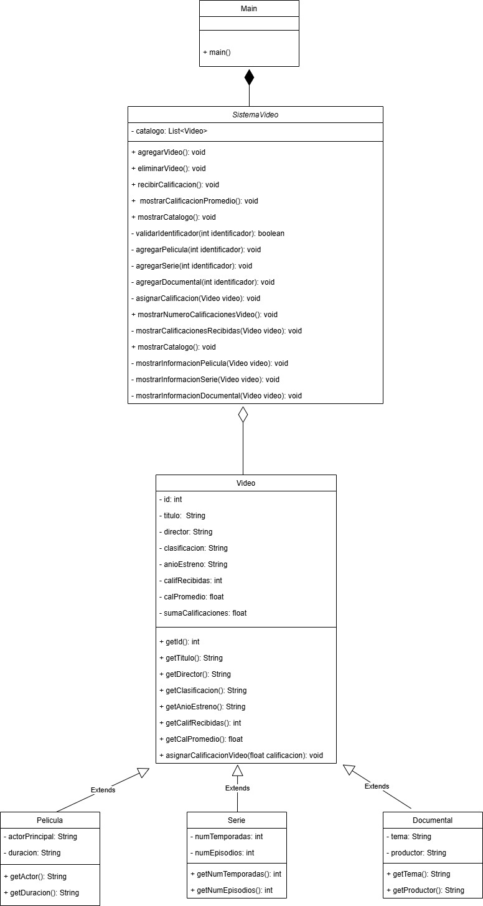

# Creación de un sistema sencillo de renta de videos (aplicación de consola)

### Requisitos para la creación de un sistema de renta de videos.

- Debe der ser una aplicación de consola
- Debe estar escrita en lenguaje de programación java o lenguaje python
- El sistema debe de permitir hacer las siguientes operaciones: agregar un nuevo video al catálogo de video, eliminar un video, recibir la calificación de un video que se quiera calificar, mostrar la calificación promedio de un video en específico, mostrar el número de calificaciones que ha recibido un video, y mostrar el catálogo total de los videos que hay registrados en el catálogo
- Los tipos de videos que se quieren guardar en el catálogo son: películas, series, y documentales.
- De cada forma general se necesita guardar la siguiente información de cada video: un identificador único que identifique al video, el titulo, el director, la clasificación, el año de estreno, las calificaciones recibidas y su calificación promedio.
- De forma particular de las peliculas además de la demás información se necesita guardar el actor principal de la película, y su duración en minutos. En el caso de las series también se desea guardar el número de temporadas que tiene la serie, y el número de episodios total de toda la serie. Y por último para los documentales se necesita guardar el tema del documental, y el productor del documental.
- Para poder solucionar el problema de necesita usar el paradigma de la programación orientada a objetos.

# Diseño de la solución.

Lenguaje de programación que se usó: Python

Dado que se tiene que usar el paradigma de la programación orientada a objetos se diseñaron las siguiente clases para la resolución: 

- Clase Main
- Clase Video
- Clase Pelicula
- Clase Serie
- Clase Documental
- Clase SistemaVideo

Los atributos entre clases, sus métodos y las relaciones que hay entre estas se ven en el siguiente diagrama de clases

## Explicación de los atributos de cada clase

# Clase Main

La clase principal Main no tiene atributos ya que hace la función de gestor, es decir, donde se podrá ejecutar todo el proyecto, lo único que tiene es el método main(), que como se dijo es el gestor donde se ejecutará todo el proyecto

# Clase SistemaVideo

La clase SistemaVideo, es la que se encargará de hacer la gran cantidad de operaciones que el sistema necesita para poder funcionar correctamente, en sus atributos solo cuenta con una lista, que se llama catálogo, donde se almacenarán los videos que se vayan agregando al sistema.

Sus métodos son los siguientes, se dará una breve pero clara explicación de cada uno de ellos, porque como se ve son varios método que están en la clase:

- agregarVideo(): void

    Este método se encarga de forma parcial de agregar un video al sistema, ya que trabaja con ayuda del método privado validarIdentificador(), lo que pasa es lo siguiente, se llama al método agregarVideo() y este le pregunta al usuario que ingrese el ID del video, este ID es enviado al método validarIdentificador(), donde este método se encarga de buscar en el catálogo (la lista) que el ID que se planea asignar no exista, ya que al ser un IDENTIFICADOR, este debe de ser único para cada video, es decir irrepetible, en caso de que exista se retorna un valor booleano false, al método agregarVideo() y se le pide al usuario que ingrese un nuevo indentificador, este proceso se repite hasta que se ingrese un ID que no se encuentre en el catálogo, en caso contrario, es decir en caso de que el ID, no se encuentre, se le pide al usuario que ingrese que tipo de video va a registrar en el catálogo, una película, una serie o un documentar, si va a agregar un video se llama a un método privado (para proteger la implementación hacia otras clases) para que llene la información correspondiente a una película, en caso de que se vaya a registrar una serie, se le manda a un método privado especial para registrar a una serie, de la misma forma si se va a registrar un documental, todos estos métodos privados donde se registra el tipo de video que se va a ingresar en el sistema se les manda el identificador que ya fue válidado con anterioridad

- eliminarVideo(): void
    Este método se encarga de eliminar el registro de un video que se encuentre en el catálogo, se le piden que ingresen el id del video, este es buscado en el mismo método en caso de que no se encuentre el ID se le manda un mensaje en pantalla al usuario de que dicho ID no se encuentra en el catálogo, en caso de que si se encuentre se le indica al usuario que dicho ID si se encontró y que el video se borró correctamente, al ser python, existe una función para borrar un objeto de esa lista, por lo que esta operación se hizó solo en este método

- recibirCalificacion(): void
    Se le pide al usuario que ingrese el ID del video, se hace la búsqueda del video, en caso de que no se encuentre un video con ese ID se le manda un mensaje en pantalla diciendole que el video no existe en el catálogo, en caso de que si se encuentre se manda este video (ese objeto) a un método privado que se llama asignarCalificacion() que es el que se encarga de ponerle esa calificación al video.

- mostrarCalificacionPromedio(): void
    Se encarga de solicitar el ID del video, en caso de que si se encuentre se muestra en pantalla el ID del video, el nombre del mismo y la calificacion promedio que tiene este, en caso de que no se encuentre se muestra en pantalla un mensaje de que el video no se encuentra en el catálogo

- mostrarCatalogo(): void
    Es un método que sirve de ayuda para mostrar la información de los videos en cuestión, ya que en el catálogo (una lista) hay objetos de tipo Pelicula, Serie y Documental cuando se recorre la lista se revisa a que tipo de objeto es el objeto que se esta trabajando en ese momento, en caso de que sea un objeto de tipo Pelicula, este objeto se le envía a un método privado donde se pueda imprimir la información correspondiente a una película, el mismo caso se repite para imprimir información de videos que sean de series o documentales

- validarIdentificador(int identificador): void
    Este método lo que hace es buscar en el catálogo que no haya un identificador igual al que se quiere asignar al nuevo video que se va a registrar ya que los identificadores únicos no se deben de repetir por lo que es por eso que se deben de hacer esas validaciones, el método es privado para proteger la encapsulación

- agregarPelicula(int identificador): void
    Lo que hace este método es agregar un video de tipo Pelicula, esto se le dice al usuario que ingrese que tipo de video va a registrar en el catálogo, en caso de que se vaya a ingresar una película se le muestra la información para que ingrese un video de tipo Pelicula, el identificador que recibe el método ya fue validado anteriormente por lo que puede ser usado para que se le asigne al nuevo registro, el método es privado para proteger la encapsulación

- agregarSerie(int identificador): void
    Este método hace el registro de un video de tipo Serie en el catálogo, por lo que se le muestra la información correspondiente al usuario para que ingrese un video de tipo Serie, el método es privado para proteger la encapsulación

- agregarDocumental(int identificador): void
    Este método se encarga de realizar el resgitro de un video de tipo documental, por lo que se le muestra al usuario la información correspondiente para que ingrese la información correspondiente a un video de tipo Documental, el método es privado para proteger la encapsulación

- asignarCalificacion(Video video): void
    Una vez que el ID fue encontrado con ayuda del método recibir calificación, el video correspondiente fue enviado a este método donde ya se le asigna la calificación que le van a poner.

- mostrarNumeroCalificacionesVideo(): void
    Se encarga de solicitar el ID del video al usuario, en caso de que se encuentre el objeto de tipo video que tiene este ID es enviado a un método privado que completa la operación, el método privado se llama mostrarCalificacionesRecibidas(Video video)

- mostrarCalificacionesRecibidas(Video video): void
    El objeto de tipo Video que recibe este método se encarga de mostrar el ID del video, el título del mismo y el número de calificaciones recibidas

- mostrarInformacionPelicula(Video video): void
    Se encarga de mostra la información correspondiente a un video de tipo Pelicula, la selección de si el video en cuestión se trata de una pelicula, serie o documental, se hizo en el método mostrarCatalogo(), es por eso que este método recibe como parámetro un objeto de tipo Video

- mostrarInformacionSerie(Video video): void
    Se encarga de mostra la información correspondiente a un video de tipo Serie, la selección de si el video en cuestión se trata de una pelicula, serie o documental, se hizo en el método mostrarCatalogo(), es por eso que este método recibe como parámetro un objeto de tipo Video

- mostrarInformacionDocumental(Video video): void
    Se encarga de mostra la información correspondiente a un video de tipo  Documental, la selección de si el video en cuestión se trata de una pelicula, serie o documental, se hizo en el método mostrarCatalogo(), es por eso que este método recibe como parámetro un objeto de tipo Video

# Clase Video

La clase Video cuenta con los siguiente atributos privados: id (se necesita para identificar el video), titulo (necesario para saber el titulo del video), director (necesario para saber el director del video), clasificacion (necesario para saber la clasificación del video), anioEstreno (necesario para saber el año de estreno de la película), califRecibidas (necesario para saber el número de calificaciones recibidas que tien un video), calPromedio (se encarga de calcular el promedio de calificaciones), sumaCalificaciones (se encarga de guardar la suma de las calificaciones que se le van haciendo a un video)

Los métodos que tiene la clase video son todos publicos para que se pueden usar en las demás clases cuando sea necesario, y son los siguientes:

* getId(): int
    
    Se encarga de retornar el valor del ID del video

* getTitulo(): String

    Se encarga de retornar el título del video

* getDirector(): String

    Se encarga de retornar el nombre del director del video

* getClasificacion(): String

    Se encarga de retornar la clasificación del video en cuestión

* getAnioEstreno(): String

    Se encarga de retornar el año de estreno del video en cuestión

* getCalifRecibidas(): int

    Se encarga de retornar en pantalla el número de calificaciones recibidas que tiene un video

* getCalPromedio(): float

    Se encarga de calcular y retornar el valor del promedio de calificaciones de un video, donde se revisa primero si el número de calificaciones recibidas de un video sea diferente de cero para poder efectuar la división correspondiente, en caso de que si sea diferente de 0, se hace la división correspondiente y se retorna el promedio, en caso de el número de calificaciones recibidas sea 0 en automático se retorna el valor de calPromedio que se le asigna cuando se crea el objeto de tipo Video que es de 0, ya que si no existiera esta revisión ocurriría una excepción (error en tiempo de ejecución) y se detendría la ejecución del programa

* asignarCalificacion(float calificacion): void

    Se encarga de asignar la calificación que se le quiere dar al video, hacer la suma de las calificaciones que está teniendo un video y también se encarga de hacer la suma del número de calificaciones que se están recibiendo

# Clase Pelicula

La clase Pelicula es una clase hija de la clase padre video, está clase hija solo le agrega los atributos privados actorPrincipal(): String, y el atributo duracion(): String

Además de que también agrega los métodos públicos getActorPrincipal(): String y getDuracion(): String, el método getActorPrincipal(): String devuelve el nombre del actor principal de la pelicula, mientras que el método getDuracion(): String devuelve la duración en minutos de la película

# Clase Serie

La clase Serie es una clase hija de la clase Video, donde la clase Serie agrega los atributos privados: numTemporadas: int, y el atributo numEpisodios: int, también incluye los métodos privados getNumTemporadas(): int y el método getNumEpisodios(): int, en donde devuelven el número de temporadas y el número de episodios totales de la serie correspondientemente

# Clase Documental

La clase Documental es una clase hija de la clase Video, donde la clase Documental agrega los atributos privados: tema: String y el atributo productor: String, además de que incluye los métodos públicos getTema(): String y getProductor(), que devuelven los temas y nombre del productor del documental correspondientemente

Cómo nota general y hacer más claro esto la clase Video es padre de las clases Pelicula, Serie y Documental

# Proceso para probar el funcionamiento del programa

- Es necesario contar con una computadora.
- Contar con un intérprete de python, de preferencia la versión 3.10.5
- Contar con un IDE que puede ejecutar scripts de python, por ejemplo: Visual Studio Code, Spyder, PyCharm, ect
- Clonar los archivos del repositorio de GitHub, deben ser 6 archivos con extensión .py, los cuales deben ser los siguientes: documental.py, main.py, pelicula.py, serie.py, sistemaVideo.py y video.py
- En caso de usar el IDE Spyder para ejecutar el proyecto solo es necesario abrir el archivo main.py y ejecutar y a partir de ahí se pueden todas las operaciones necesarias del sistema, en caso de usar otro IDE diferente se recomienda abrir los demás archivos que componen el proyecto y ya ejecutarlo.

Nota adicional: La información de los videos se guarda en una lista de python, por lo que cuando se termine la ejecución del programa dicha información se borrará, ya que la información no se guarda en un archivo (persistencia de objetos)

